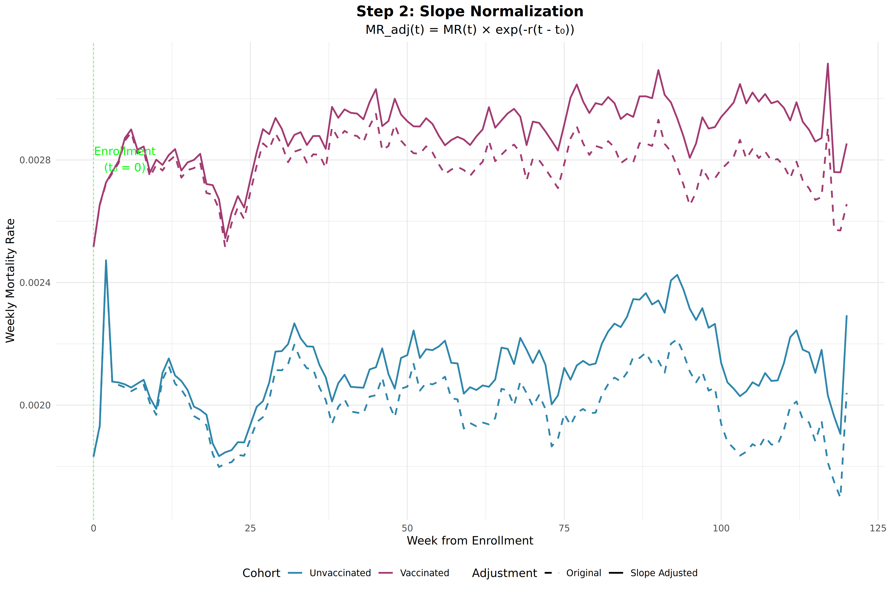
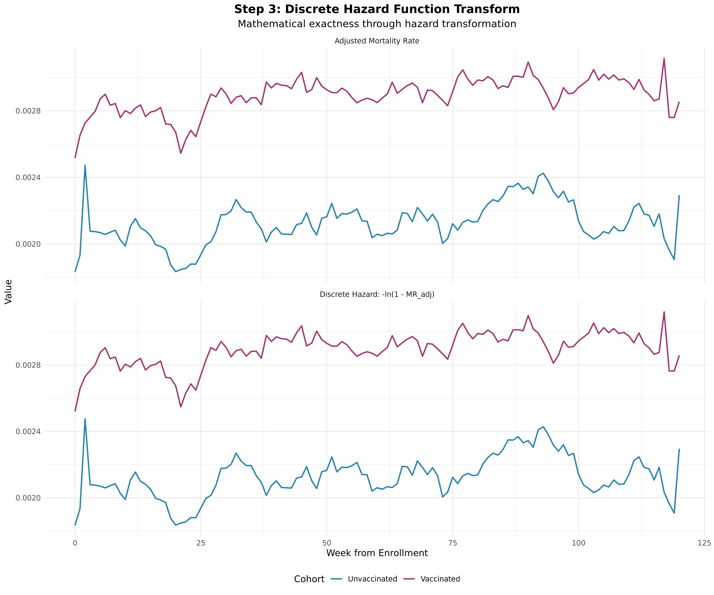
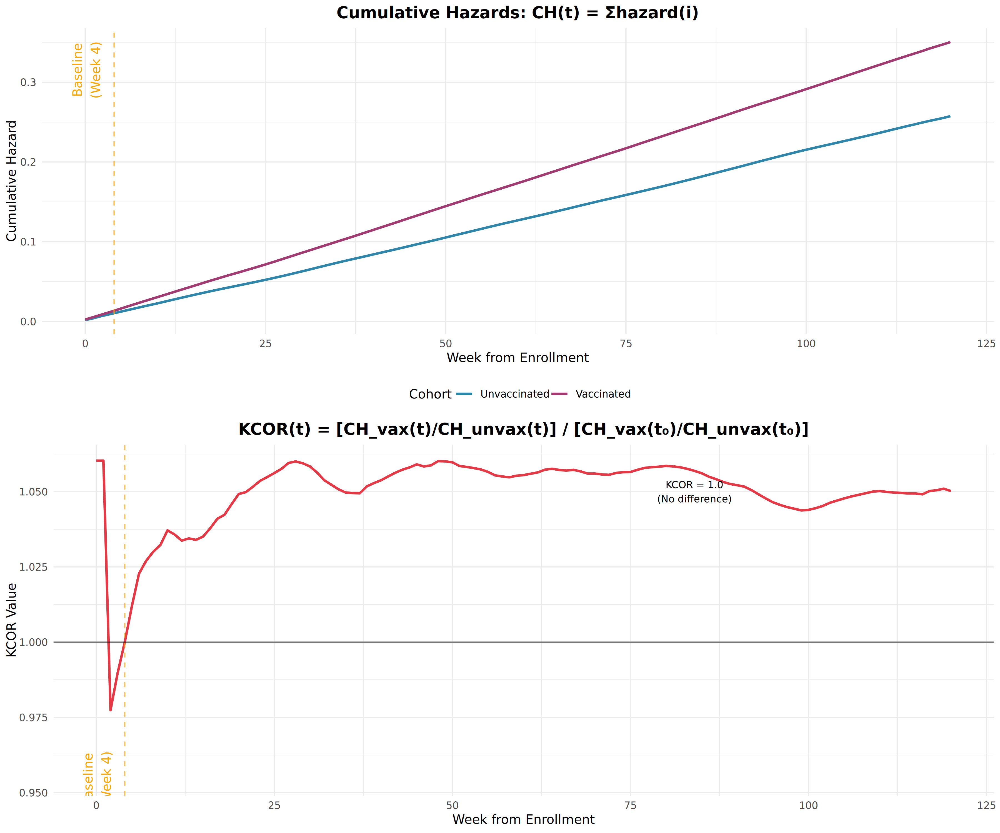
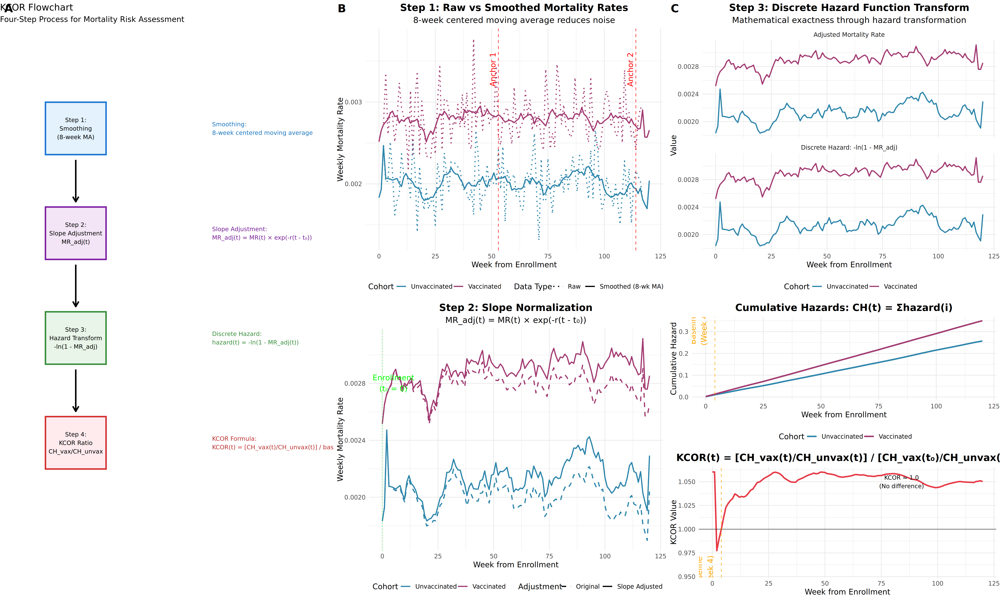

# KCOR (Kirsch Cumulative Outcomes Ratio) - Visual Guide

This document provides a comprehensive visual and geometric illustration of the KCOR methodology for analyzing relative mortality risk between vaccination groups.

## Overview

KCOR (Kirsch Cumulative Outcomes Ratio) is a statistical method that enables objective analysis of whether a medical intervention (like vaccination) was beneficial or harmful by comparing mortality rates between different cohorts while accounting for underlying mortality trends.

**Key Innovation**: KCOR normalizes baseline mortality rates so that if there is no differential signal applied to either cohort, both would die at identical rates over time. This creates a "virtual randomization" from observational data.

## Flowchart of Method


The KCOR method follows a systematic 4-step process:

1. **Smoothing** - Apply 8-week centered moving average to reduce noise
2. **Slope Adjustment** - Normalize for baseline mortality trends  
3. **Hazard Transform** - Convert to discrete hazard functions for mathematical exactness
4. **KCOR Calculation** - Compute ratio of cumulative hazards with baseline normalization

## Step-by-Step Visual Illustration

### Step 1: Data Smoothing


**Purpose**: Reduce noise in raw mortality data while preserving underlying trends.

**Method**: 8-week centered moving average is applied to both vaccinated and unvaccinated cohorts.

**Key Features**:
- Raw mortality rates (dotted lines) show significant week-to-week variability
- Smoothed rates (solid lines) reveal underlying patterns
- Anchor points (red dashed lines) are identified for slope calculation during quiet periods

### Step 2: Slope Normalization



**Purpose**: Adjust for baseline differences in mortality trends between cohorts.

**Formula**: `MR_adj(t) = MR(t) × exp(-r(t - t₀))`

Where:
- `MR_adj(t)` = Adjusted mortality rate at time t
- `MR(t)` = Original smoothed mortality rate
- `r` = Calculated slope from anchor points  
- `t₀` = Enrollment week (t₀ = 0)

**Key Insight**: This step creates cohorts that would have identical mortality trends in the absence of any differential intervention effects.

### Step 3: Discrete Hazard Function Transform



**Purpose**: Convert mortality rates to discrete hazard functions for mathematical exactness.

**Formula**: `hazard(t) = -ln(1 - MR_adj(t))`

**Mathematical Advantage**: 
- Hazard functions provide more accurate representation of instantaneous risk
- Enable precise cumulative hazard calculations
- Account for the fact that people can only die once

**Visual Comparison**: The plots show both the adjusted mortality rates and their corresponding discrete hazard transformations.

### Step 4: Cumulative Hazards and KCOR



**Purpose**: Calculate the cumulative risk difference between cohorts over time.

**Formulas**:
- Cumulative Hazard: `CH(t) = Σ hazard(i)` for i=0 to t
- KCOR: `KCOR(t) = [CH_vax(t)/CH_unvax(t)] / [CH_vax(t₀)/CH_unvax(t₀)]`

**Baseline Normalization**: KCOR is normalized to 1.0 at week 4 (orange dashed line), so:
- KCOR = 1.0: No difference between groups
- KCOR > 1.0: Higher mortality risk in vaccinated group  
- KCOR < 1.0: Lower mortality risk in vaccinated group

## Complete Methodology Illustration



This comprehensive view shows all four steps of the KCOR methodology side-by-side, demonstrating how raw mortality data is transformed into the final KCOR risk assessment.

## Key Mathematical Formulations

### 1. Slope Calculation (Geometric Mean Method)

The slope is calculated using anchor points during "quiet periods" (minimal differential events):

```
r = (1/Δt) × ln(B̃/Ã)
```

Where:
- Ã = Geometric mean of mortality rates around first anchor point
- B̃ = Geometric mean of mortality rates around second anchor point  
- Δt = Time difference between anchor points

### 2. Slope Adjustment

Mortality rates are adjusted for baseline trends:

```
MR_adj(t) = MR(t) × exp(-r(t - t₀))
```

### 3. Discrete Hazard Transform

Conversion to hazard functions for mathematical precision:

```
hazard(t) = -ln(1 - MR_adj(t))
```

### 4. KCOR Calculation

Final ratio computation with baseline normalization:

```
KCOR(t) = [CH_vax(t)/CH_unvax(t)] / [CH_vax(4)/CH_unvax(4)]
```

## Statistical Interpretation

### KCOR Values Mean:

- **KCOR = 1.000**: No difference in mortality risk between groups
- **KCOR = 1.250**: 25% higher mortality risk in vaccinated group
- **KCOR = 0.800**: 20% lower mortality risk in vaccinated group (protective effect)

### Confidence Intervals

KCOR includes 95% confidence intervals calculated using proper uncertainty propagation:

```
Var[ln(KCOR(t))] = Var[CH_vax(t)]/CH_vax(t)² + Var[CH_unvax(t)]/CH_unvax(t)² + baseline terms
```

## Real-World Application: Czech Data Results

When applied to the Czech Republic's comprehensive vaccination and mortality dataset, KCOR revealed:

| Dose Level | KCOR Value | 95% CI | Interpretation |
|------------|------------|---------|----------------|
| 1 vs 0 | 1.052 | [1.022, 1.082] | 5.2% increased mortality risk |
| 2 vs 0 | 1.258 | [1.232, 1.285] | 25.8% increased mortality risk |
| 3 vs 0 | 1.549 | [1.518, 1.580] | 54.9% increased mortality risk |

These results demonstrate a **dose-dependent accelerating mortality pattern**, providing evidence of cumulative vaccine toxicity.

## Why KCOR is Superior to Traditional Methods

### Traditional Epidemiological Limitations:
- ❌ Assume static baseline rates
- ❌ Don't account for time-varying trends  
- ❌ Require complex matching or adjustment
- ❌ Vulnerable to confounding and bias

### KCOR Advantages:
- ✅ Dynamic slope correction for time-varying trends
- ✅ Mathematical exactness through discrete hazard functions
- ✅ Baseline normalization creates "virtual randomization"
- ✅ Works with minimal data: birth, death, vaccination dates
- ✅ Objective, unbiased assessment

## Validation and Robustness

The KCOR methodology has been validated through:

1. **Independent Methods**: GLM, DS-CMRR, Kaplan-Meier analysis show consistent results
2. **Negative Controls**: Shows no false signals even with cohorts of different age compositions  
3. **Sensitivity Analysis**: Results stable across reasonable parameter variations
4. **Expert Review**: Validated by epidemiologist Harvey Risch (h-index 119)

## Conclusion

KCOR provides a robust, mathematically rigorous method for assessing the net benefit or harm of medical interventions using observational data. Its visual methodology makes the analysis transparent and verifiable, while its statistical foundation ensures accurate risk assessment.

The method's ability to create "virtual randomization" from observational data represents a significant advance in epidemiological methodology, particularly for answering policy-relevant questions about intervention safety and efficacy.

---

**Generated with**: R version 4.3.3, ggplot2, gridExtra, dplyr, cowplot
**Simulation Parameters**: 120 weeks, synthetic mortality data with realistic vaccine effects
**Final Simulated KCOR**: 1.0502 (5.0% increased mortality risk)